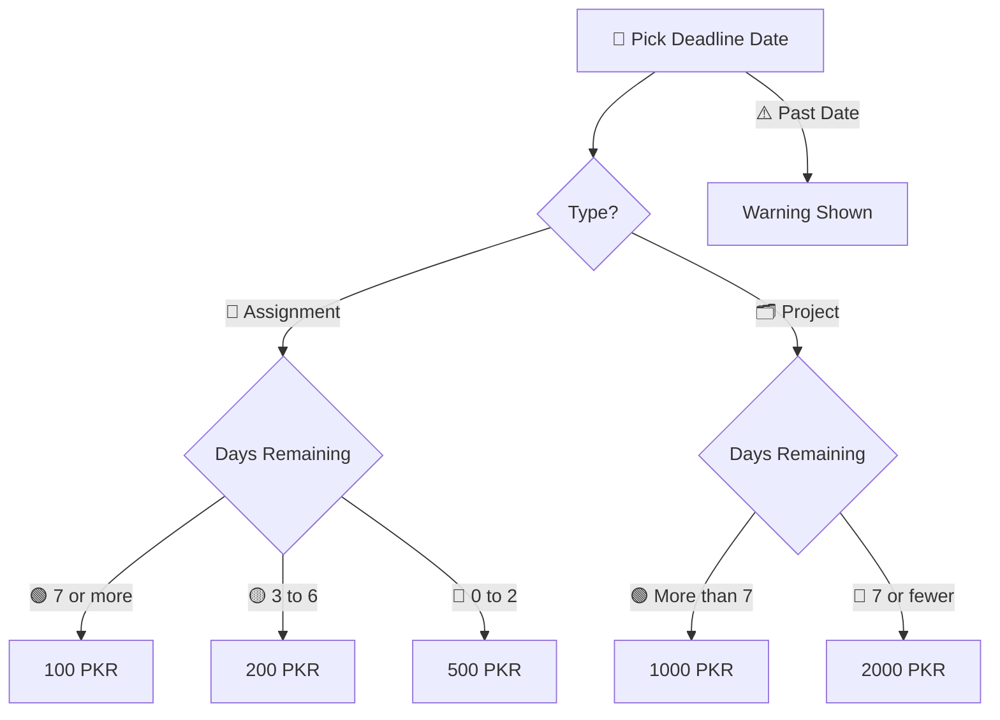

<div align="center">


<br/>


<br/>

🔗 **Live Demo:** [assignment-2-static-webpage-silk.vercel.app](https://assignment-2-static-webpage-silk.vercel.app/)

<a href="https://assignment-2-static-webpage-silk.vercel.app/">

</a>

</div>

<br/>

> 📘 A responsive static webpage offering assignment and project services with instant price calculation and direct contact options.

<div align="center">

</div>

---

## 📖 About The Project

This is a single page static website built as part of the **Codoc IT Internship Development Programme, Assignment 2**. It serves as a professional service page where students can:

- 💰 Check pricing for assignments and projects based on deadline urgency
- 📩 Send direct messages via Gmail using a contact form
- 📱 Connect instantly via WhatsApp for quick inquiries

The page is fully responsive and works seamlessly on desktop, tablet, and mobile devices.

---

## ✨ Features

<div align="center">

| Feature | Description |
|---------|-------------|
| 💰 **Price Calculator** | Select "Assignment" or "Project", pick a deadline date, and get an instant price quote in PKR |
| 📩 **Contact Form** | Sends messages directly to abdulazeem7982@gmail.com via Gmail's mailto functionality |
| 📱 **WhatsApp Integration** | One click button to start a chat on WhatsApp at +92 322 8535002 |
| 📐 **Responsive Design** | Optimized for all screen sizes using CSS Flexbox, Grid, and Media Queries |
| 🧭 **Semantic HTML** | Clean, accessible markup using header, nav, main, section, and footer tags |
| 🎨 **Modern UI** | Professional color scheme with hover effects and smooth transitions |

</div>

<br/>

## 💰 Pricing Logic

The calculator works out the price based on how many days remain until the deadline.

<div align="center">



</div>

**📝 Assignments**

- 🟢 7 or more days remaining, 100 PKR
- 🟡 3 to 6 days remaining, 200 PKR
- 🔴 0 to 2 days remaining, 500 PKR

**🗂️ Projects**

- 🟢 More than 7 days remaining, 1000 PKR
- 🔴 7 or fewer days remaining, 2000 PKR

If the selected deadline date is in the past, the calculator shows a warning and does not return a price. ⚠️

<br/>

## 🛠️ Built With

<div align="center">

- 🧱 **HTML5**, semantic markup structure
- 🎨 **CSS3**, custom styling with Flexbox, Grid, and responsive media queries
- ⚙️ **JavaScript (Vanilla)**, price calculation logic and form handling
- 🌿 **Git and GitHub**, version control with feature branch workflow
- ▲ **Vercel**, deployment and hosting

<br/>


&nbsp;

&nbsp;

&nbsp;

&nbsp;


</div>

<br/>

## 🚀 Deployment

This project is deployed on **Vercel** for free and reliable hosting.

🔗 **Live URL:** [assignment-2-static-webpage-silk.vercel.app](https://assignment-2-static-webpage-silk.vercel.app/)

<br/>

## 📂 Project Structure

```
assignment-2-static-webpage/
├── 📄 index.html   # Main HTML file
├── 🎨 style.css    # All styles and responsive design
├── ⚙️ script.js    # Price calculator and contact form logic
└── 📘 README.md    # Project documentation
```

<br/>

## 🔧 Git Workflow

This project follows a clean Git workflow as required by the assignment:

- 🌿 **Feature Branch:** `feature/website` was used for development
- 📝 **Meaningful Commits:** Each commit has a clear, descriptive message
- 🔀 **Merge to Main:** The feature branch was successfully merged into main

<br/>

## 💻 Getting Started

To run this project locally:

```bash
# Clone the repository
git clone https://github.com/AbdulAzeemHashmi/assignment-2-static-webpage.git

# Navigate into the project folder
cd assignment-2-static-webpage

# Open index.html in your browser
```

No build tools or dependencies are required, it is a pure HTML, CSS, and JavaScript project. 🎉

<br/>

## 👨‍💻 Author

<table>
<tr>
<td>🧑‍💻 <b>Name</b></td>
<td>Abdul Azeem</td>
</tr>
<tr>
<td>🐙 <b>GitHub</b></td>
<td><a href="https://github.com/AbdulAzeemHashmi">@AbdulAzeemHashmi</a></td>
</tr>
<tr>
<td>✉️ <b>Email</b></td>
<td>abdulazeem7982@gmail.com</td>
</tr>
<tr>
<td>📱 <b>WhatsApp</b></td>
<td>+92 322 8535002</td>
</tr>
</table>

<br/>

## 📝 License

This project is built for educational purposes as part of the Codoc IT Internship Programme.

<br/>

## 🙏 Acknowledgments

- 🏢 Codoc IT Ltd. for providing the training and assignment guidelines
- 📚 All resources and documentation that helped in building this project

<br/>

<div align="center">

### ⭐ If you found this project helpful, consider giving it a star

<a href="https://github.com/AbdulAzeemHashmi/assignment-2-static-webpage/stargazers">

</a>

<br/><br/>

Made with 🧡 by Abdul Azeem for the Codoc IT Internship Development Programme.


</div>
